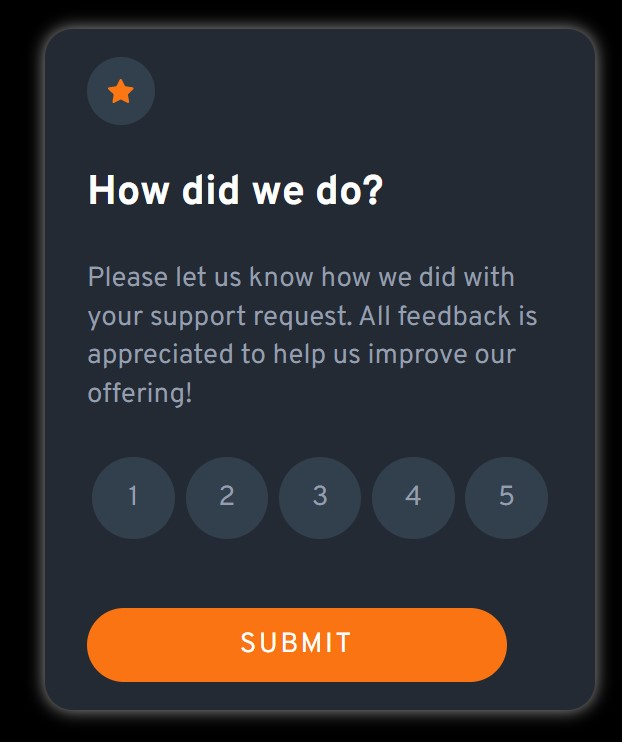
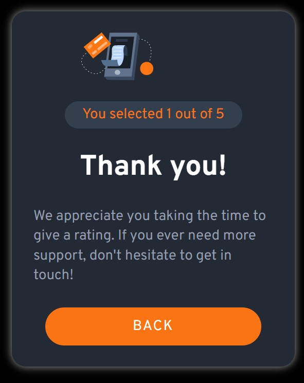

# Frontend Mentor - Interactive rating component solution

This is a solution to the [Interactive rating component challenge on Frontend Mentor](https://www.frontendmentor.io/challenges/interactive-rating-component-koxpeBUmI). Frontend Mentor challenges help you improve your coding skills by building realistic projects. 

## Table of contents

- [Overview](#overview)
  - [The challenge](#the-challenge)
  - [Screenshot](#screenshot)
  - [Links](#links)
- [My process](#my-process)
  - [Built with](#built-with)
  - [What I learned](#what-i-learned)
- [Author](#author)

## Overview

### The challenge

Users should be able to:

- View the optimal layout for the app depending on their device's screen size
- See hover states for all interactive elements on the page
- Select and submit a number rating
- See the "Thank you" card state after submitting a rating

### Screenshot




### Links

- Solution URL: [Github](https://github.com/XshubhamG/Rating-Section.git)
- Live Site URL: [Netlify](https://peaceful-llama-3e598e.netlify.app/)

## My process

### Built with

- Semantic HTML5 markup
- CSS custom properties
- Flexbox
- CSS Grid
- Mobile-first workflow
- JavaScript 
- DOM

**Note: These are just examples. Delete this note and replace the list above with your own choices**

### What I learned


```js
// variables

let ratingSection = document.querySelector('.rating__section');
let thankyouSection = document.querySelector('.thankyou__section');
let stars = document.querySelectorAll('.star');
let submit = document.getElementById('submit');
let back = document.getElementById('back');


// submit section

submit.addEventListener('click',() => {
        ratingSection.classList.add('inactive');
        thankyouSection.classList.add('active');  
});

// back section
back.addEventListener('click',() => {
        ratingSection.classList.remove('inactive');
        thankyouSection.classList.remove('active');  
});

// rating section 

stars.forEach((star)=>{
    star.addEventListener('click', () => {
             document.getElementById('rate').innerHTML = star.innerHTML; 
    });
```

## Author

- Website - [Shubham Giri](https://www.your-site.com)
- Frontend Mentor - [@XshubhamG](https://www.frontendmentor.io/profile/XshubhamG)
- Twitter - [@codin_nerd](https://www.twitter.com/codin_nerd)

